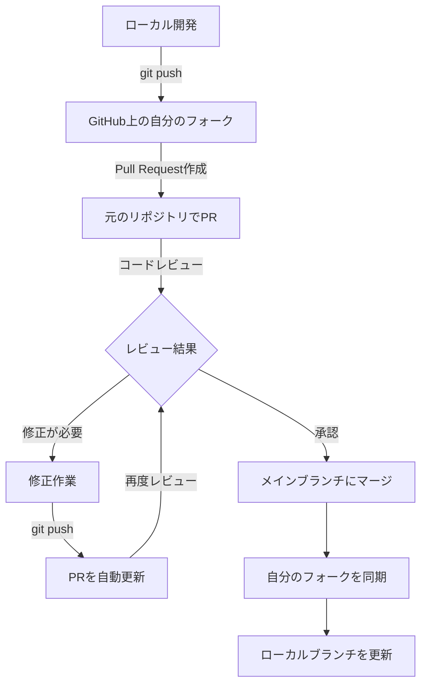

# 🔄 開発ワークフローガイド

> Fork-based開発流程による協作開発の手順

## 📖 開発流程について

このプロジェクトでは **Fork-based開発流程** を採用しています。これは複数の開発者が安全に協力できる標準的な方法です。

### 🔀 Fork-based開発流程とは

1. **Fork** - 元のリポジトリを自分のアカウントにコピー
2. **Clone** - フォークしたリポジトリをローカルに複製
3. **Branch** - 機能ごとに新しいブランチを作成
4. **Develop** - ローカルで開発作業
5. **Push** - 自分のフォークにプッシュ
6. **Pull Request** - 元のリポジトリに統合を依頼
7. **Review** - コードレビューと修正
8. **Merge** - 承認後に統合

---

## 🔄 日常的な開発サイクル

> **前提条件**: [プロジェクト開始ガイド](getting-started.md)に従って初回セットアップが完了していること

### 1️⃣ 開発前の準備

### 2️⃣ GitHubでフォークを同期

1. **GitHubでフォークのページ**にアクセス
2. 「**Sync fork**」ボタンをクリック
3. **更新があるかどうか確認**：
   - 「This branch is up to date」→ 更新不要
   - 「This branch is X commits behind」→ 更新が必要
4. 更新が必要な場合、「**Update branch**」をクリック

#### VS Code でローカルを更新

1. VS Codeの**ソース管理パネル** (`Ctrl + Shift + G`) を開く
2. **更新があるかどうか確認**：
   - ブランチ名の横に「↓」矢印 → リモートに新しいコミットがある
   - 何も表示されない → ローカルは最新
3. 更新がある場合：
   - 「**...** (その他のアクション)」メニューをクリック
   - 「**プル**」を選択してローカルブランチを更新

これで、upstream の最新変更がローカルに反映されます。

### 3️⃣ 機能ブランチの作成

#### 開発前の計画

開発を始める前に、元のリポジトリで**Issue**を作成して目的を明確にします：

1. **元のリポジトリのIssuesページ**にアクセス
2. 「**New issue**」をクリック
3. **明確なタイトル**を設定：
   - 新機能：`feat: 住居探しページの追加`
   - バグ修正：`fix: ナビゲーションメニューの表示崩れ`
   - ドキュメント：`docs: 翻訳追加ガイドの作成`
4. **詳細な説明**を記入：
   - 何を実装/修正するか
   - なぜ必要なのか
   - どのように実装するか

#### VS Code でブランチ作成

Issue作成後、VS Codeで新しいブランチを作成：

#### 方法1: VS Code UI

1. **左下隅のステータスバー**で現在のブランチ名をクリック
2. 「**新しいブランチの作成...**」を選択
3. ブランチ名を入力（例：`feature/add-housing-page-issue-15`）

#### 方法2: コマンドプロンプト

> 💡 **Windows環境の選択肢**: コマンドプロンプト（`cmd`）のほか、PowerShellも使用できます。どちらでも以下のGitコマンドは動作します。

```cmd
# 新しい機能ブランチを作成
git checkout -b feature/機能名

# 例：Issue #15 の住居探しページを追加する場合
git checkout -b feature/add-housing-page-issue-15
```

#### ブランチ命名規則

- **新機能**: `feature/機能名-issue-番号`
- **バグ修正**: `fix/問題名-issue-番号`
- **ドキュメント**: `docs/内容-issue-番号`
- **スタイル改善**: `style/改善内容-issue-番号`

> 💡 **命名のポイント**:
>
> - `#` 文字はシェル（zsh、bash等）で特殊文字として解釈される場合があるため、ブランチ名には `issue-` プレフィックスを使用します
> - `番号` は実際のIssue番号に置き換えてください（例：`issue-15`, `issue-23`）

### 4️⃣ 開発作業

#### 開発環境の準備

1. **VS Codeでプロジェクトを開く**
2. **Live Server拡張機能を起動**してリアルタイムプレビューを確認
3. **ソース管理パネル**で現在のブランチが正しいことを確認

#### 開発の進め方

1. **Issueの要件を確認**し、実装内容を明確にする
2. **小さな単位で変更**を行い、こまめに保存とテストを実施
3. **変更が完了したら次のステップへ**進む

> **詳細な開発ガイド**: 具体的なコーディング方法やファイル構造については、別途開発ガイドドキュメントを参照してください。

### 5️⃣ 変更のコミット

#### VS Codeソース管理パネルの活用

VS Codeの**ソース管理パネル**を使って、変更を効率的に管理できます：

##### **ファイル変更の確認**

1. **ソース管理パネル** (`Ctrl + Shift + G`) を開く
2. **変更されたファイルの確認**：
   - **M**マーク：修正されたファイル
   - **A**マーク：新しく追加されたファイル
   - **D**マーク：削除されたファイル
3. ファイル名をクリックして**差分を表示**

##### **ステージングとコミット**

1. **個別ファイルのステージング**：
   - ファイルの横の「**+**」ボタンをクリック
   - またはファイルを右クリック→「変更をステージ」
2. **全ファイルのステージング**：
   - 「変更」セクションの「**+**」ボタンをクリック
3. **コミットメッセージの入力**：
   - 上部のテキストボックスに**明確なメッセージ**を入力
   - 例：`feat: 交通情報ページを追加`
4. **コミットの実行**：
   - 「**✓ コミット**」ボタンをクリック

##### **コミットメッセージの書き方**

```text
<type>: <description>

Examples:
feat: 新機能の追加
fix: バグの修正
docs: ドキュメントの更新
style: コードスタイルの修正
refactor: コードリファクタリング
```

### 6️⃣ 変更をフォークにプッシュ

コミットが完了したら、変更を**自分のフォークしたリポジトリ**にプッシュします：

#### VS Codeでのプッシュ操作

1. **ソース管理パネル**で「...」メニューをクリック
2. 「**プッシュ**」を選択
3. 初回プッシュの場合、「**プッシュ（上流を発行）**」を選択

#### コマンドプロンプトでのプッシュ

```cmd
# 現在のブランチを自分のフォークにプッシュ
git push origin feature/add-housing-page-issue-15

# 初回プッシュの場合（上流ブランチを設定）
git push -u origin feature/add-housing-page-issue-15
```

> **重要**: プッシュ先は**自分のフォークしたリポジトリ**（`origin`）です。元のリポジトリ（`upstream`）に直接プッシュすることはできません。

### 7️⃣ プルリクエストの作成

プッシュが完了したら、GitHub上でプルリクエストを作成して、元のリポジトリへの統合を依頼します：

#### GitHubでの操作

1. **自分のフォークのページ**にアクセス
2. 「**Compare & pull request**」ボタンをクリック（プッシュ後に自動表示される）
3. **プルリクエスト設定を確認**：
   - **Base repository**: `kanghouchao/japan-life-guide` (base: `main`) ← 元のリポジトリ
   - **Head repository**: `あなたのユーザー名/japan-life-guide` (compare: `feature/add-housing-page-issue-15`) ← 自分のフォーク
4. **タイトルと説明を記入**：
   - タイトル：`feat: 住居探しページを追加 #15`
   - 説明：実装内容、変更点、関連するIssue番号を記載
5. 「**Create pull request**」をクリック

#### プルリクエストの流れ



---

## 🛠️ トラブルシューティング

### よくある問題と解決方法

#### ❓ Git関連のトラブル

##### **Q: コミットできない（何も変更されていない）**

**原因**: ファイルがステージングされていない

**解決方法**:

1. VS Codeのソース管理パネルで変更されたファイルを確認
2. ファイルの「**+**」ボタンをクリックしてステージング
3. コミットメッセージを入力してコミット

##### **Q: プッシュできない（rejected）**

**原因**: リモートブランチに新しいコミットがある

**解決方法**:

1. ソース管理パネルで「**...**」メニューをクリック
2. 「**プル**」を選択して最新の変更を取得
3. 競合がある場合は解決
4. 再度プッシュ

##### **Q: マージ競合が発生した**

**解決方法**:

1. VS Codeが競合ファイルを表示
2. **「現在の変更を使用」**または**「受信する変更を使用」**を選択
3. 手動で編集が必要な場合は、`<<<<<<<` マーカーを参考に修正
4. 修正後、ファイルをステージングしてコミット

#### ❓ VS Code関連のトラブル

##### **Q: Live Serverが起動しない**

**解決方法**:

1. Live Server拡張機能がインストールされているか確認
2. HTMLファイルが開かれているか確認
3. VS Codeを再起動
4. ファイアウォールがポート5500をブロックしていないか確認

##### **Q: ソース管理パネルに変更が表示されない**

**解決方法**:

1. ファイルが保存されているか確認（`Ctrl + S`）
2. VS Codeでプロジェクトフォルダが正しく開かれているか確認
3. `.gitignore` ファイルで除外されていないか確認

##### **Q: コマンドプロンプトでgitコマンドが使えない**

**解決方法**:

1. Gitがインストールされているか確認（`git --version`）
2. VS Codeを再起動
3. システムのPATH環境変数にGitが追加されているか確認

#### ❓ 開発環境のトラブル

##### **Q: フォークが最新でない**

**解決方法**:

1. GitHubでフォークのページにアクセス
2. 「**Sync fork**」ボタンをクリック
3. 「**Update branch**」で最新化
4. VS Codeでプルしてローカルも更新

##### **Q: 変更が反映されない**

**解決方法**:

1. ブラウザのキャッシュをクリア（`Ctrl + F5`）
2. Live Serverを再起動
3. ファイルが正しく保存されているか確認

### 📞 サポートが必要な場合

解決できない問題がある場合は、以下の方法でサポートを求めてください：

1. **GitHubのIssuesで質問**  
   [japan-life-guide/issues](https://github.com/kanghouchao/japan-life-guide/issues) で新しいIssueを作成

2. **詳細情報を含める**  
   - 使用しているOS（Windows 10/11など）
   - エラーメッセージの全文
   - 実行したコマンドと結果
   - スクリーンショット（可能であれば）

3. **タイトルの付け方**  
   - `help: 〇〇で困っています` の形式で記入
   - 例：`help: Live Serverが起動しません`
